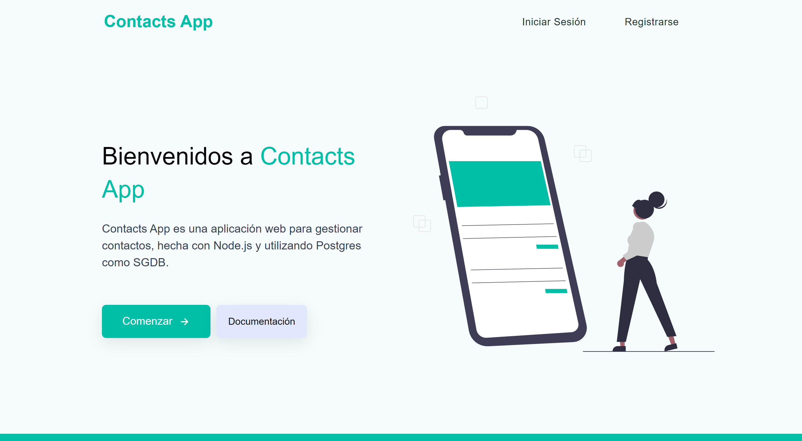

<!-- Cabecera principal -->
<div align="center">
  <a href="https://github.com/othneildrew/Best-README-Template">
    
  </a>

  <h3 align="center">Contacts App - Documentación</h3>
</div>


  


-----------------------------------------------------------------------   
<!-- Cabecera del indice -->
<div id="top"></div>  

## Indice
<ul>
    <li><a href="#screenshots">Screenshots</a></li>
    <!-- <li><a href="#acerca-del-proyecto">Acerca del proyecto</a></li> -->
    <li><a href="#instalación">Instalación</a></li>
    <li><a href="#tecnologias-utilizadas">Tecnologias Utilizadas</a></li>
    <li><a href="#contactos">Contactos</a></li>
</ul>


-----------------------------------------------------------------------
<!-- Screenshots -->
## Screenshots
### Desktop 
<div align="center">
    
</div> <br /> <br />

### Mobile
<div align="center">
    
</div>

<p align="right">(<a href="#top">Volver al indice</a>)</p> 
</br>   


<!-- -----------------------------------------------------------------------
<!-- Acerca del proyecto -->
<!-- ## Acerca del proyecto -->
<!-- Este proyect


<p align="right">(<a href="#top">Volver al indice</a>)</p> 
</br>   -->


-----------------------------------------------------------------------
<!-- Instalación -->
## Instalación

1. Clonar el repositorio
   ```sh
   https://github.com/moises35/Contacts_App.git
   ```
2. Instalar los módulos con NPM
   ```sh
   npm install
   ```
3. Crear un archivo en la raiz del proyecto con el nombre `.env` para definir las configuraciones de las variables de entorno
   ```config
    # Aplicación
    PORT=3000

    # Base de datos (se colocan las credenciales de la BD)
    HOST= host
    USER= user 
    PASSWORD= password
    DATABASE= databaseName
    PORT_DB= portDatabase

    # Vencimiento de token
    JWT_VENCIMIENTO= tiempoDeVencimiento
    JWT_CLAVE= claveParaelToken
    JWT_COOKIE_VENCIMIENTO= tiempoDeVencimiento
   ```
4. Ejecutar el script que se encuentra en el archivo `database.sql` utilizando el SGDB PostgreSQL
5. Una vez creadas las tablas del archivo `database.sql` ya se puede ejecutar la aplicación con NPM:
    ```sh
    npm run serve
   ```
6. ¡Listo!


<p align="right">(<a href="#top">Volver al indice</a>)</p> 
</br>   


-----------------------------------------------------------------------
<!-- Tecnologias utilizadas -->
## Tecnologias utilizadas


- ![Node]  
- ![Express]   
- ![Postgres]   
- ![HTML]   
- ![CSS]   
- ![JavaScript]   
- ![Heroku]


<p align="right">(<a href="#top">Volver al indice</a>)</p> 
</br>   


-----------------------------------------------------------------------
<!-- Contactos -->
## Contactos

Moisés Alvarenga - oscar.moises350@gmail.com

Link del proyecto: [https://github.com/moises35/Contacts_App](https://github.com/moises35/Contacts_App)


<p align="right">(<a href="#top">Volver al indice</a>)</p> 
</br>   


<!-- Links a las imagenes de los lenguajes -->
[Express]: https://img.shields.io/badge/Express.js-404D59?style=for-the-badge
[HTML]: https://img.shields.io/badge/HTML5-E34F26?style=for-the-badge&logo=html5&logoColor=white
[CSS]: https://img.shields.io/badge/CSS3-1572B6?style=for-the-badge&logo=css3&logoColor=white
[Node]: https://img.shields.io/badge/Node.js-43853D?style=for-the-badge&logo=node.js&logoColor=white
[Postgres]: https://img.shields.io/badge/PostgreSQL-316192?style=for-the-badge&logo=postgresql&logoColor=white
[Javascript]: https://img.shields.io/badge/JavaScript-F7DF1E?style=for-the-badge&logo=javascript&logoColor=black
[Heroku]: https://img.shields.io/badge/Heroku-430098?style=for-the-badge&logo=heroku&logoColor=white